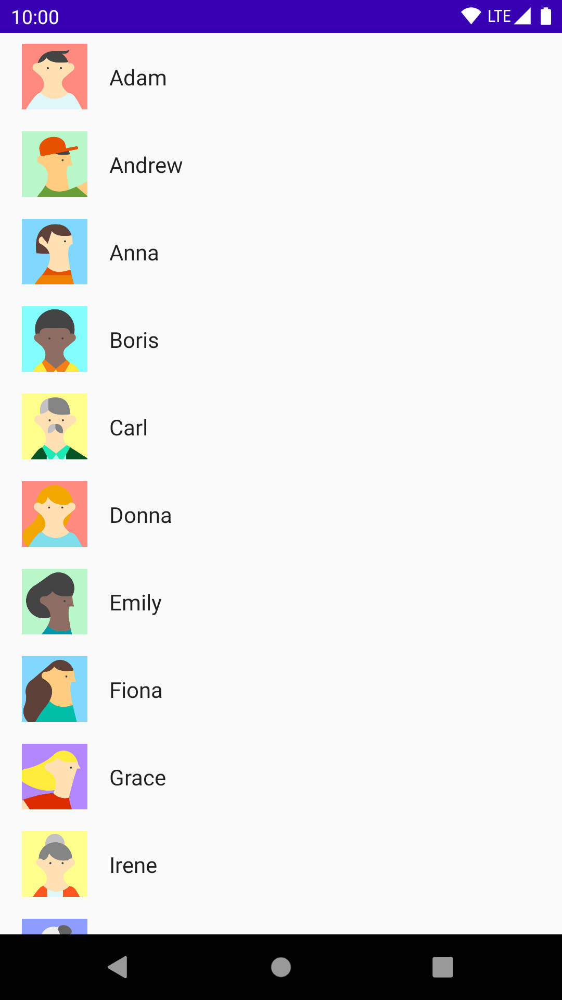
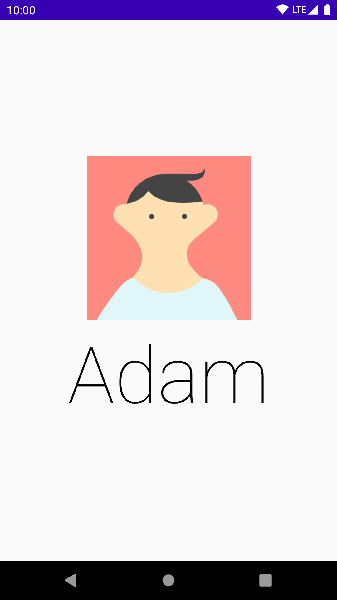

# compose-shared-element
Proof of concept exploration of how to implement SharedElement transition in Jetpack Compose.  
Inspired by Flutter Hero widget.  

Transition consists of following animations:
- Position
- Scale
- Crossfade (which makes it work on any kind of element, e.g. `Text`)
<br>

| **UsersListScreen**:<br><br><br>**UserDetailScreen**:<br> | Slowed down transition animation:<br> |
| --- | --- |


# Usage
1. Define `FROM` and `TO` elements with shared tag
```kotlin
@Composable
fun ScreenA() {
  // ...
  
    SharedElement(tag = "tag", type = SharedElementType.FROM) {
        Image(image, Modifier.preferredSize(48.dp))
    }
  
  // ...
}

@Composable
fun ScreenB() {
  // ...
  
    SharedElement(tag = "tag", type = SharedElementType.TO) {
        Image(image, Modifier.preferredSize(200.dp))
    }
    
  // ...
}
```

2. Make `SharedElementsRoot` a common parent of `ScreenA` and `ScreenB`. It doesn't have to be their direct parent.  
```kotlin
SharedElementsRoot {
    // change between ScreenA and ScreenB
}
```

3. Transition starts automatically when second `SharedElement` is detected

# Sample
See sample usage with `UsersListScreen` and `UserDetailsScreen` [here](sample/src/main/java/com/mobnetic/compose/sharedelement/sample/MainActivity.kt).

# Issues
Considering the experimental state of this library and state of Jetpack Compose itself there are some issues described [here](https://github.com/mobnetic/compose-shared-element/issues).
